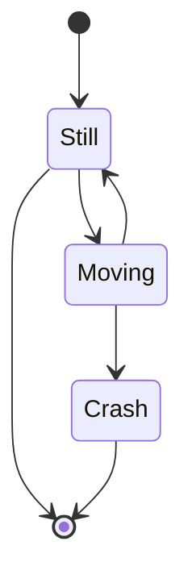
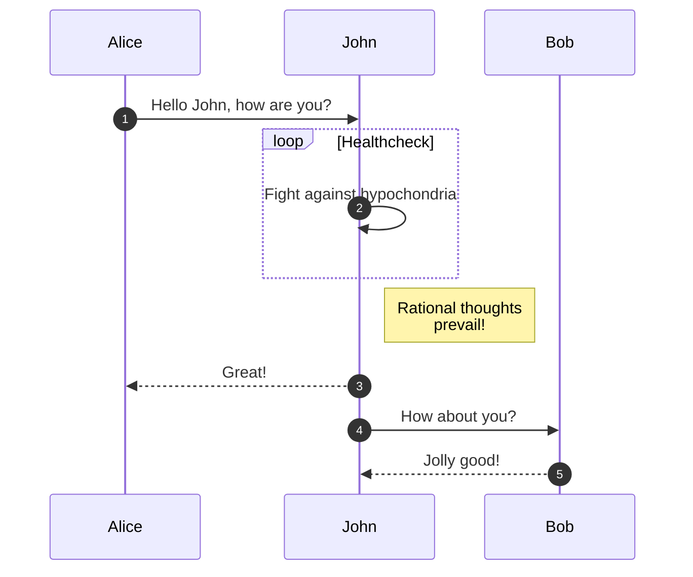
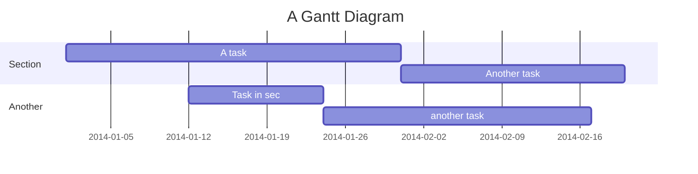
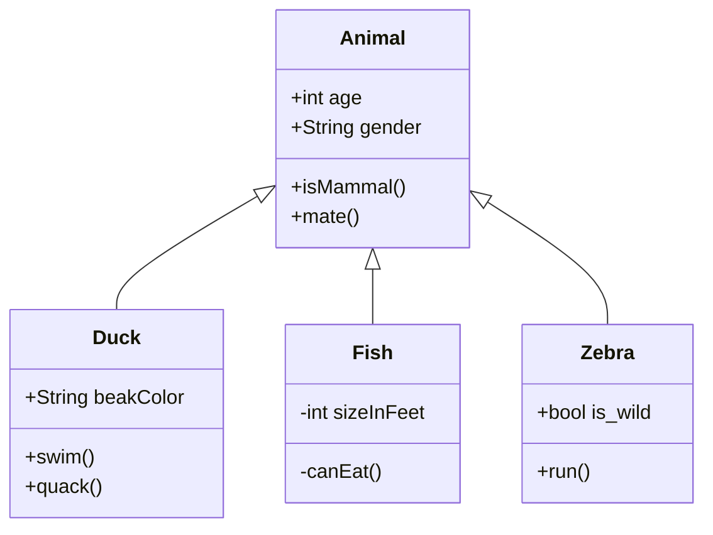
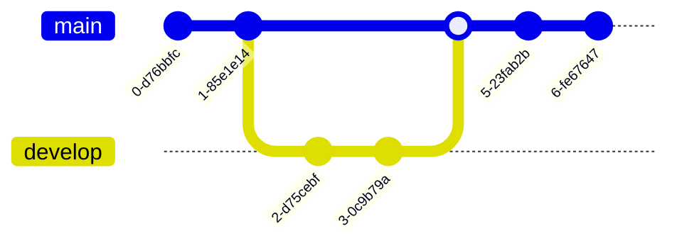

This post demonstrates how to write and render **Mermaid** diagrams directly within your Markdown and MDX files. Since we use `mermaid: true` in the frontmatter, the Mermaid client library is loaded only on this page, keeping the rest of the site lightweight and zero-JS.

Below are several examples of complex diagrams, ranging from flowcharts to Gantt charts!

## State Diagram

To render a diagram, wrap your Mermaid code in a fenced code block with the `mermaid` language identifier:

````markdown

````

Which automatically renders as:


## Sequence Diagram



## Gantt Chart



## Class Diagram



## Git Graph


