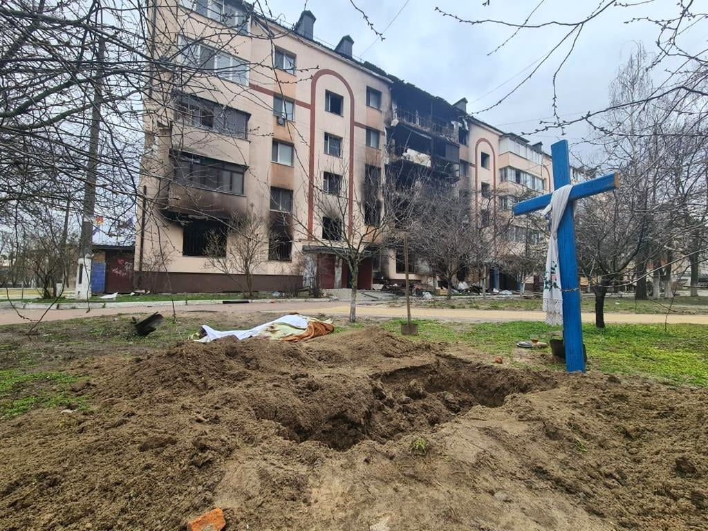

La paura è uno degli strumenti più forti mai sperimentati da Putin negli ultimi vent'anni. Godere di una supremazia prima psicologica e poi tecnica è ormai una tattica da manuale per l'esercito russo, una pratica che va di pari passo con le immagini di distruzione arrivate dalla Cecenia fino all'invasione dell'Ucraina iniziata a febbraio.

Se oggi conosciamo bene il significato della [lettera Z](https://www.rollingstone.it/politica/putin-town-and-z-boys-analisi-dellitalietta-fascia-rossa-bruna-boh/642131/) — vista su tanti mezzi militari mobilitati ai confini russi per l'invasione, o "operazione speciale" di denazificazione — e sappiamo che è diventata il simbolo di molti sostenitori dell'aggressione all'Ucraina, possiamo anche azzardare ad associarla a una parola che, almeno nei media russi, andava molto di moda nei primi anni Duemila: **zachistka**.

Zachistka è un termine russo che possiamo tradurre come "pulizia", nel senso ampio del termine. (A questo proposito, l'idea di ripulire la terra ricorda la metafora adottata nella Germania di Hitler, quella di [Völkische Flurbereinigung](http://katalog.g-h-h.de/vufind/Record/ghh-592581091) — "pulizia del terreno" — ripresa anche dalla terminologia agricola.) Durante la seconda guerra cecena Putin avviò quella che definì un'"_operazione speciale finalizzata al controllo dei permessi di soggiorno e all'identificazione dei partecipanti alle formazioni armate illegali_". Sì, anche quello era un'operazione speciale, e fece molti danni. Chiariamo subito una cosa: praticare la zachistka in Cecenia non era una novità; i russi lo avevano già fatto durante la prima guerra combattuta (e persa), quando era ancora presidente Eltsin. In quel caso, però, il termine aveva un significato più specifico, usato esclusivamente dai militari: fare piazza pulita dei ribelli e dei civili che li sostenevano. Nella seconda guerra cecena la zachistka assunse un significato e una pratica differenti. L'esercito circondava e neutralizzava un intero villaggio — in genere periferico — con l'uso di mezzi militari pesanti, compresi gli elicotteri, e impediva a qualsiasi civile di entrare o uscire dalla zona. L'accerchiamento era poi monitorato dai soldati coscritti, mentre [FSB](https://it.wikipedia.org/wiki/Federal%27naja_slu%C5%BEba_bezopasnosti), [GRU](https://it.wikipedia.org/wiki/Glavnoe_razvedyvatel%27noe_upravlenie) e forze speciali entravano nei villaggi da diverse direzioni: con veicoli, con elicotteri, con lanci col paracadute. La battaglia, a senso unico, avveniva strada per strada; le case venivano prese d'assalto durante il giorno, ma anche alle prime luci dell'alba o di notte.

Molte delle operazioni condotte in questo modo dai russi entrarono, una volta scoperte, nella lunga lista delle violazioni dei diritti umani avvenute nel territorio caucasico. Alla ferocia delle forze speciali si aggiunsero i saccheggi e l'estrema crudeltà verso diverse etnie, tanto da colpire i media e le associazioni di volontariato presenti sul territorio, come scrissero i testimoni di Medici Senza Frontiere:

> **Un costante clima di terrore — Civili sottoposti alla violenza indiscriminata di forze russe** — I resoconti dei testimoni raccolti di recente dalle équipe di MSF descrivono sparatorie indiscriminate, arresti arbitrari, esecuzioni sommarie, percosse, ecc. a cui i ceceni sono soggetti tutti i giorni. Abusi come questi sono più spesso commessi dai soldati russi durante la zachistka o operazioni di bonifica finalizzate allo scovare i "terroristi". La maggior parte, tuttavia, avviene quotidianamente, in modo del tutto arbitrario, durante gli spostamenti della popolazione, e soprattutto ai posti di blocco militari fissati in tutti i principali incroci e punti di ingresso.
>
> — Medici Senza Frontiere, [link](https://www.msf.org/sites/msf.org/files/2019-04/MSF%20Speaking%20Out%20Chechnya%201994-2004.pdf)

Sempre secondo diverse testimonianze, sappiamo che col passare del tempo le operazioni di zachistka non furono più soltanto aggressioni militari, ma assunsero i contorni di detenzioni di massa dei residenti locali, soprattutto a partire dal 2002. Le persone detenute venivano portate nei "**punti di filtrazione temporanea**", dove venivano sottoposte a percosse e torture. In questo modo le forze federali contavano di ottenere informazioni sulla gente del villaggio che sosteneva gli insorti e nascondeva le armi. L'inefficienza dei punti di filtrazione era dovuta alla mancanza di dati sistematizzati sui detenuti; questo portò a detenzioni di massa di innocenti, che spesso si lasciavano andare a confessioni estorte con l'intimidazione. Inoltre i punti di filtrazione non avevano alcuna natura giuridica: vennero creati e usati illegalmente e molto spesso fecero scomparire detenuti in attesa di riconoscimento. Come in una pratica già consolidata nell'ex Jugoslavia, molti degli scomparsi vennero identificati solo dopo che i loro corpi furono trovati disseminati in una dozzina di discariche sparse per il paese.

Nel 1999, ancor prima della presa del potere da parte di Putin, "zachistka" era ormai entrata saldamente nel discorso pubblico, e i tentativi di contestarne il significato si rivelarono inefficaci. Se ne parlò per la prima volta quando, tra il 7 e l'8 aprile 1995, le truppe russe circondarono il villaggio ceceno di [Samashki](https://en.wikipedia.org/wiki/Samashki_massacre) per "ripulirlo" dai combattenti, massacrando 101 civili e bruciando e saccheggiando le loro case. A dicembre il settimanale russo [Moskovskie Novosti](https://www.mn.ru/) pubblicò un articolo intitolato "Parole dell'anno" (Slovo Goda) nel tentativo di identificare le parole d'ordine più popolari e simboliche del 1999, nella tradizione del quotidiano tedesco Frankfurter Allgemeine Zeitung (FAZ). La prima parola della lista era **zachistka**, che per il governo continuava a essere una normale **operazione di controllo dei passaporti**.

Se ci fermiamo un attimo a riflettere, possiamo interpretare la proliferazione della parola zachistka come emblematica di un nuovo modo di pensare il problema ceceno di allora: era sintomatica di un'accettazione, o tolleranza, dell'impunità che regnava in Cecenia. Come ha commentato [Emil Pain](https://www.wikidata.org/wiki/Q4342197), ex consigliere per le relazioni nazionali della Russia, "usando il gergo militare professionale nei loro rapporti, i giornalisti danno alla guerra un sapore quotidiano". E questo cambiamento di linguaggio non fece che rafforzare l'impunità sul campo. Molti sono cresciuti accettando le massicce violazioni delle regole di guerra come il costo necessario per ripulire le "concentrazioni terroristiche". Mosca era lontana dagli orrori quotidiani della vita del ceceno medio: un accerchiamento e un assalto a un luogo abitato erano considerati operazioni antiterroristiche comuni, impiegate da molti paesi del mondo, ma il loro utilizzo sistematico e quasi quotidiano non era, allora come adesso, tollerabile — soprattutto dopo le documentazioni e i resoconti dei superstiti emersi diversi anni dopo.

## Esempi di Zachistka

### Novye Aldi

Il massacro di Novye Aldi fu l'esecuzione sommaria, da parte delle forze federali russe, di un numero compreso tra 60 e 82 civili nel sobborgo di Novye Aldi (Aldy) a Grozny, nel corso di un'operazione di "rastrellamento" condotta il 5 febbraio 2000. A seguito di una furia mortale delle forze speciali di polizia, tra 60 e 82 civili furono uccisi e almeno sei donne furono violentate. Numerose case furono bruciate e i saccheggi vennero compiuti in modo organizzato. L'indagine ufficiale stabilì che l'"operazione di pulizia" era stata condotta dalla polizia paramilitare dell'OMON di San Pietroburgo (forse anche dall'oblast di Ryazan). Nel 2016 le autorità russe non erano ancora riuscite a ritenere nessuno responsabile del crimine. La colpevolezza dello Stato russo per gli omicidi di Aldi e la negazione della giustizia alle vittime furono formalmente stabilite in due diverse sentenze della Corte europea dei diritti dell'uomo nel 2006-2007. La popolazione del villaggio era di 27.000 persone prima della guerra, ma la maggior parte dei residenti era fuggita dai combattimenti negli ultimi mesi del 1999, lasciando dietro di sé circa 2.000 persone troppo anziane o comunque incapaci di mettersi in salvo.

Il 4 febbraio, dopo che il grosso delle forze separatiste cecene aveva lasciato Grozny, una delegazione di anziani del villaggio di Aldi si recò con una bandiera bianca a informare il comando militare russo dell'assenza di combattenti ceceni nel sobborgo. Furono colpiti mentre si avvicinavano alle postazioni federali (uno di loro, di etnia russa, rimase ferito nella sparatoria e in seguito morì), ma alla fine riuscirono a negoziare la cessazione dei bombardamenti. Le prime forze russe arrivate ad Aldi nel pomeriggio del 4 febbraio — soldati di leva visibilmente stanchi della battaglia, molto giovani, in divise sporche e logore — non incontrarono alcuna resistenza e attraversarono l'insediamento senza commettere atti illegali. Avvertirono gli abitanti di aver incontrato truppe estremamente severe ("come bestie") che stavano arrivando dietro di loro. Consigliarono ai civili di lasciare le cantine ma di non abbandonare la relativa sicurezza delle loro case, e di preparare i documenti d'identità.

Dopo il massacro, gli abitanti decisero collettivamente di non seppellire subito i corpi (come invece richiesto dalla tradizione musulmana), ma di tenerli all'interno delle case affinché la loro morte potesse essere documentata. In seguito le forze russe tornarono ad Aldi in numerose occasioni per saccheggiare e minacciare i residenti di rappresaglie se avessero parlato di ciò a cui avevano assistito. Se il 5 febbraio ci fu qualche saccheggio, quello sistematico e su vasta scala ebbe luogo per la prima volta nella settimana successiva, incluso il 10 febbraio, quando l'OMON tornò in gran numero ad Aldi e iniziò a radunare tutti i maschi ceceni che riusciva a trovare, portandone via 16 insieme a interi camion di oggetti saccheggiati (in seguito furono restituiti vivi). Nonostante il peso delle prove e una serie di inchieste da parte di giornalisti stranieri e russi e di organizzazioni per i diritti umani, nessuna indagine ufficiale sul crimine fu mai completata. Per diversi anni nessuno fu accusato in relazione all'accaduto: un fatto non insolito, dato che un gran numero di civili fu giustiziato in via extragiudiziale dalle forze federali nel corso del conflitto ceceno e che pochissimi degli autori furono processati.

### Alkhan-Kala

Il 22 giugno 2001 le truppe russe iniziarono una zachistka su Alkhan-Kala, un grande villaggio a sud-ovest di Grozny, innescando uno scontro armato con i separatisti ceceni. Alkhan-Kala era il villaggio natale di Arbi Barayev, uno dei più potenti signori della guerra separatisti in Cecenia e fondatore dello Special Purpose Islamic Regiment, una sorta di sindacato della criminalità organizzata islamista che aveva terrorizzato la Cecenia durante l'indipendenza seguita alla prima guerra. Ufficialmente, Barayev fu dichiarato ucciso in azione nel raid iniziale e il suo corpo fu poi consegnato alla famiglia. La battaglia tra forze russe e separatisti proseguì comunque per sei giorni e portò alla massiccia distruzione di Alkhan-Kala, con combattimenti casa per casa che lasciarono decine di edifici distrutti. Secondo i funzionari russi, molti dei complici di Barayev furono uccisi e circa 800 abitanti del villaggio furono presi in custodia.

Arbi Barayev era il leader separatista più importante a essere stato ucciso o catturato dai russi dall'inizio della seconda guerra cecena nel 1999, e la sua morte fu salutata da Mosca come un grande successo. Secondo una versione alternativa, però, fu catturato vivo e consegnato all'FSB, la principale agenzia di sicurezza russa, ma era ricercato anche da membri del GRU, l'intelligence militare, per un possibile coinvolgimento nella sospetta morte del tedesco Ugryumov. Presumibilmente il GRU arruolò combattenti ceceni coinvolti in una faida di sangue con Barayev per fare irruzione nel complesso dell'FSB dove era tenuto in custodia, rapirlo e consegnarlo al GRU presso la base militare di Khankala, dove sarebbe stato torturato a morte.

### Tsotsin-Yurt

L'operazione Tsotsin-Yurt fu un'operazione di tipo zachistka delle forze speciali russe (Spetsnaz) a Tsotsin-Yurt, in Cecenia, dal 30 dicembre 2001 al 3 gennaio 2002, durante la seconda guerra cecena. L'operazione di quattro giorni sfociò in scontri armati con i separatisti ceceni e si concluse in una situazione di stallo con numerose vittime. Le forze russe furono accusate di diffuse violazioni dei diritti umani, compresi saccheggi, pulizia etnica e sparizioni forzate. Secondo il gruppo russo per i diritti umani Memorial, l'operazione fu accompagnata da gravi e massicce violazioni dei diritti umani e della legge russa. Le accuse includevano saccheggio e distruzione sfrenata di proprietà civili, profanazione di una moschea, rapine ed estorsioni di massa, percosse e torture di circa 100 detenuti nel "punto di filtrazione", di cui 11 scomparsi con la forza e cinque brutalmente assassinati. Fu segnalato anche l'uso di scudi umani da parte delle forze russe. Fonti dei media stranieri riferirono dell'uccisione di 37, o addirittura 80, civili nel corso dell'operazione, ma la notizia non fu confermata da Memorial. Secondo una lettera aperta del marzo 2002, durante la guerra 41 residenti di Tsotsin-Yurt morirono o scomparvero durante le cosiddette operazioni di rastrellamento: più di 20 morirono per ferite da arma da fuoco o bombardamenti, cinque furono uccisi ai posti di blocco, sei furono torturati a morte e 12 furono prelevati dalle loro case per essere interrogati.

### Borozdinovskaya

L'operazione Borozdinovskaya fu una zachistka dei membri del Battaglione Speciale Vostok, un'unità etnica cecena dello Spetsnaz GRU, il 4 giugno 2005, nel villaggio della minoranza etnica avara di Borozdinovskaya, vicino al confine tra Cecenia e Daghestan. Secondo l'indagine ufficiale, quel giorno circa 80 soldati ceceni del battaglione Vostok, su due mezzi corazzati per il trasporto di personale, diversi camion e automobili, arrivarono nel villaggio alle 15:00 per eseguire una zachistka. Testimoni oculari affermarono che l'operazione fu guidata da Khamzat (Hamzat) Gairbekov, noto anche come "Barba", capo dell'intelligence dell'unità Vostok. Tra le 15:30 e le 20:00 i soldati arrestarono 11 persone "sospettate di aver commesso crimini": Abakar Aliyev, Magomed Isayev, Ahmed Kurbanaliyev, Magomed Kurbanaliyev, Eduard Lachkov (di etnia russa), Ahmed Magomedov, Kamil Magomedov, Said Magomedov, Shakhban Magomedov e Martukh Umarov. Nessuno di loro fu più rivisto. Successivamente fu trovato il cadavere di un uomo di 77 anni, ucciso a colpi d'arma da fuoco e bruciato vivo; circa 200 uomini furono radunati e portati nel palazzetto dello sport della scuola locale, dove molti furono duramente picchiati. Quattro fattorie private furono bruciate e auto, denaro e altri oggetti di valore furono rubati ai residenti.

Il raid del battaglione Vostok provocò un esodo di massa di quasi l'intera popolazione del villaggio e contribuì a una situazione di stallo politico sia in Cecenia sia in Daghestan. La maggior parte dei residenti fece rapidamente i bagagli e attraversò il confine con il Daghestan, dove stabilì una tendopoli vicino alla città di Kizlyar. Lì ricevette il sostegno dell'opposizione locale degli avari e resistette ai tentativi della polizia antisommossa dell'OMON del Daghestan di costringerla a rientrare in Cecenia. I rifugiati accettarono infine di tornare dopo che il governo ceceno filorusso di Ramzan Kadyrov permise di cercare gli abitanti rapiti e di risarcire i danni causati dal battaglione. Dmitry Kozak, l'inviato presidenziale russo nel Distretto Federale Meridionale, incontrò gli abitanti del villaggio e parlò di "un atto di sabotaggio contro lo Stato russo da parte di estremisti", promettendo un'indagine obiettiva per punire i responsabili.

### Blagoveščensk (Baschiria)

Il pestaggio di massa di Blagoveščensk è il nome di un'operazione zachistka di quattro giorni condotta dall'[OMON](https://it.wikipedia.org/wiki/OMON) locale a Blagoveščensk, in Bashkortostan, dal 10 al 14 dicembre 2004. Circa 500-1.500 persone, pari al 2,5% della popolazione della città, furono arbitrariamente detenute dall'OMON e sottoposte ad abusi fisici. Le detenzioni di massa, che coinvolsero anche adolescenti e disabili, furono criticate come punizione collettiva per il fatto che Blagoveščensk era una delle poche città del Bashkortostan ad aver votato contro il terzo mandato di Murtaza Rakhimov come presidente della repubblica.

### Bucha (Ucraina)

Nel 2022 "zachistka" è tornata a essere una parola tristemente nota per quanto accaduto in sobborghi come Bucha (e, volendo, Irpin). Come in Cecenia, si è trattato di una sorta di "pulizia" di chi era rimasto nel villaggio, a pochi chilometri da Kiev, in una zona periferica — proprio come accadde nei dintorni di Grozny.

_Una fossa a Bucha, nell'oblast di Kiev, l'8 aprile 2022, dopo l'occupazione russa. Foto: Polizia nazionale ucraina, via Wikimedia Commons — CC BY 4.0_

[Secondo il sindaco della città](https://www.bbc.com/news/world-europe-61442387) e altre autorità locali, a Bucha furono recuperati circa 1.000 corpi, di cui 31 bambini. Le prove fotografiche mostravano cadaveri di civili allineati con le mani legate dietro la schiena, fucilati a bruciapelo: un elemento che sembrava provare l'avvenuta esecuzione sommaria. Un'inchiesta di [Radio Free Europe](https://en.wikipedia.org/wiki/Radio_Free_Europe/Radio_Liberty) ha confermato l'uso di un seminterrato, sotto un campeggio, come camera di tortura: un modello aggiornato dei "punti di filtraggio" ceceni. Molti corpi sono stati trovati mutilati e bruciati; ragazze di appena quattordici anni hanno riferito di essere state violentate da soldati russi. L'Ucraina ha chiesto alla [Corte penale internazionale](https://en.wikipedia.org/wiki/International_Criminal_Court) di indagare su quanto accaduto, nell'ambito delle indagini in corso sull'invasione, per determinare se siano stati commessi [crimini di guerra](https://en.wikipedia.org/wiki/Russian_war_crimes) o [crimini contro l'umanità](https://en.wikipedia.org/wiki/Crimes_against_humanity).

Le autorità russe, dal canto loro, hanno negato ogni responsabilità e hanno invece affermato che l'Ucraina avesse simulato i filmati dell'evento o inscenato gli omicidi come un'operazione [false flag](https://en.wikipedia.org/wiki/False_flag), sostenendo che immagini e fotografie dei cadaveri fossero notizie false dei media occidentali. Tali affermazioni sono state smentite da diversi gruppi e organizzazioni giornalistiche. Le testimonianze oculari dei residenti attribuiscono le uccisioni alle forze armate russe, avvalorate da riprese satellitari, dai droni e dai racconti dei sopravvissuti.
